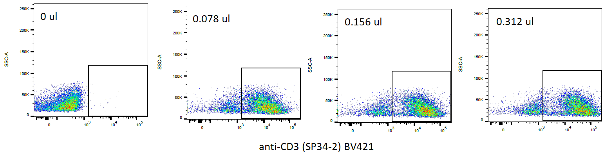
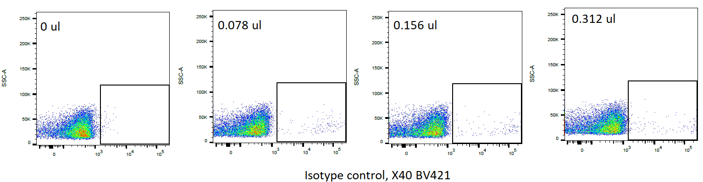

```{r, echo=FALSE}
knitr::opts_chunk$set(echo = TRUE)
options(encoding = "UTF-8")
```

## \textcolor{nhprrblue}{Goal}
To test the reactivity of [BV421 Mouse Anti-Human CD3](https://www.bdbiosciences.com/en-us/products/reagents/flow-cytometry-reagents/research-reagents/single-color-antibodies-ruo/bv421-mouse-anti-human-cd3.562877) (Catalog# 562877) from BD Biosciences on *Callithrix jacchus* (Common marmoset) peripheral blood mononuclear cells (PBMCs).


## \textcolor{nhprrblue}{Antibodies}
|                  | **Primary Antibody**             | **Isotype control**                  |
|------------------|:---------------------------------|:-------------------------------------|
|**Antibody name** |BV421 Mouse Anti-Human CD3        |BV421 Mouse IgG1, k Isotype Control   |
|**Alternate name**|CD3E; CD3-epsilon; T3E; TCRE      |IgG1, kappa Isotype Control (Anti-KLH)|
|**Clone name**    |SP34-2                            |X40                                   |
|**Immunogen**     |Purified Human CD3-epsilon Protein|Keyhole limpet hemocyanin (KLH)       |
|**Isotype**       |Mouse BALB/c IgG1                 |Mouse BALB/c IgG1                     |
|**Vendor**        |BD Biosciences                    |BD Biosciences                        |
|**Catalog number**|562877                            |562438                                |
|**Lot number**    |1025796                           |136398                                |

## \textcolor{nhprrblue}{Experiment Information}
|                                |                           |
|--------------------------------|---------------------------|
|**Species**                     |*Callithrix jacchus*       |
|**Common name**                 |Common marmoset            |
|**Animal ID**                   |cj2060                     |
|**Animal facility**             |MD Anderson                |
|**Sample type**                 |PBMC                       |
|**Experiment type**             |Flow cytometry/ Titration  |
|**Number of cells/experiment**  |100,000                    |
|**Volume/ experiment**          |100 ul                     |
|**Date of Experiment**          |May 06, 2021               |
|**Experiment by**               |Shubham Dutta              |
\newpage
## \textcolor{nhprrblue}{Protocol}
* Thaw PBMCs on ice, centrifuge at 500xg for 5 minutes.
* Add 1000 ul of ice cold Flow staining media (RPMI1640 w/ L-glutamine+2% FBS+1mM EDTA) and centrifuge at 500xg for 5 minutes.
* Add 1000 ul of ice cold Flow staining media and pass through nylon mesh.
* Count cells using AOPI and adjust volume such that there are 100,000 cells/ 100 ul of ice cold Flow staining media.
* Block with BioRad human blocking buffer for 10 minutes on ice according to manufacturer's protocol (5 ul per 100 ul of cells).
* Add primary antibodies and incubate for 30 minutes on ice in the dark.
* Centrifuge at 500g for 5 minutes to remove primary antibody and wash cells with Flow staining media.
* Add 100 ul of 1% PFA in PBS for 30 minutes on ice to fix the cells.
* Centrifuge at 500g for 5 minutes to remove 1% PFA solution.
* Add 100 ul of PBS and store in dark at 4C until acquisition.

## \textcolor{nhprrblue}{Results}

BV421 Mouse Anti-Human CD3  


BV421 Mouse IgG1, k Isotype Control  


## \textcolor{nhprrblue}{Conclusion}
* BV421 Mouse Anti-Human CD3 (SP34-2) stains on Marmoset (cj2060) PBMCs.